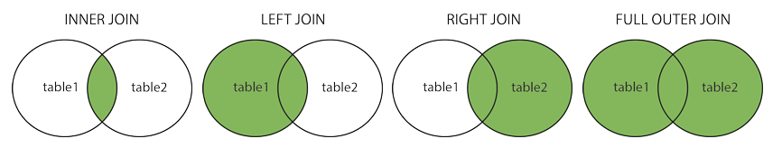

# SQL Cheatsheet

## Joins
* (inner) join
* left (outer) join
* right (outer) join
* full (outer) join



* You can access the code for the join examples below here: http://sqlfiddle.com/#!9/211a92/3/0

tablePerson
----------------    
PersonId | Name
---------|-------
1        | Adam
2        | Sue
3        | Bill
4        | Anne

tableGrade
--------------------------- 
GradeId | PersonId | Grade
--------|----------|-------
1       | 1        | 5
2       | 1        | 7
3       | 2        | 1
4       | 4        | 0
5       | 4        | 9
6       | 5        | 3


* INNER JOIN EXAMPLE
```SQL
SELECT A.PersonId, A.Name, B.GradeId, B.PersonId, B.Grade
FROM tablePerson A
INNER JOIN tableGrade B ON A.PersonId = B.PersonId
```

-----------------------------------------------    
PersonId | Name  | GradeId | PersonId | Grade |
---------|-------|---------|----------|-------|
1        | Adam  | 1       | 1        | 5     |
1        | Adam  | 2       | 1        | 7     |
2        | Sue   | 3       | 2        | 1     |
4        | Anne  | 4       | 4        | 0     |
4        | Anne  | 5       | 4        | 9     |

Note that Bill does not appear in the results and nor does PersonId 5 (from the tableGrade table)


* LEFT OUTER JOIN EXAMPLE
```SQL
SELECT * 
FROM tablePerson A
LEFT OUTER JOIN tableGrade B ON A.id = B.id
```
-----------------------------------------------    
PersonId | Name  | GradeId | PersonId | Grade |
---------|-------|---------|----------|-------|
1        | Adam  | 1       | 1        | 5     |
1        | Adam  | 2       | 1        | 7     |
2        | Sue   | 3       | 2        | 1     |
4        | Anne  | 4       | 4        | 0     |
4        | Anne  | 5       | 4        | 9     |
3        | Bill  | (null)  | (null)   | (null)|


## Wildcards
* * represents zero or more characters (bl* finds black, blue, blight)
* ? represents a single character (h?t finds hot, hat, hit)
* [] represents a single character (h[oa]t finds hot and hat, but not hit)
* ! represents any character not in the brackets (h[!oa]t finds hit, but not hat and hot)
* ‐ represents a range of charcters (c[a-b]t finds cat and cbt)
* # represents any single numeric character (2#5 finds 205, 215, 225, 235, 245, 255, 265, 275, 285, and 295)
* SQL example: SELECT * FROM Customers WHERE City LIKE 'ber%';
* SQL example: SELECT * FROM Customers WHERE City LIKE '[bp]%'; (returns all cities that start with the letter b or p)

## Case Statement
```
CASE
 WHEN condition1 THEN result1
 WHEN condition2 THEN result2
 WHEN conditionN THEN resultN
 ELSE result
END;
```
```
SELECT CustomerName, City, Country
FROM Customers
ORDER BY
(CASE
    WHEN City IS NULL THEN Country
    ELSE City
END);
```

## Running Totals (Window Function)
[](https://youtu.be/qDddVDDPf_w)
<br>[click image to watch a video demonstration (code is below)]

```
CREATE TABLE Students
(
  Id INT IDENTITY,
  Name VARCHAR (50),
  Gender VARCHAR (50),
  Age INT,
  PRIMARY KEY (Id)
);

INSERT INTO Students (Name, Gender, Age) VALUES ('Sally', 'Female', 14 );
INSERT INTO Students (Name, Gender, Age) VALUES ('Edward', 'Male', 12 );
INSERT INTO Students (Name, Gender, Age) VALUES ('Jon', 'Male', 13 );
INSERT INTO Students (Name, Gender, Age) VALUES ('Liana', 'Female', 10 );
INSERT INTO Students (Name, Gender, Age) VALUES ('Ben', 'Male', 11 );
INSERT INTO Students (Name, Gender, Age) VALUES ('Elice', 'Female', 12 );
INSERT INTO Students (Name, Gender, Age) VALUES ('Nick', 'Male', 9 );
INSERT INTO Students (Name, Gender, Age) VALUES ('Josh', 'Male', 12 );
INSERT INTO Students (Name, Gender, Age) VALUES ('Liza', 'Female', 10 );
INSERT INTO Students (Name, Gender, Age) VALUES ('Wick', 'Male', 15 );

(shows a running total along with a running average)
SELECT Id, Name, Gender, Age,
SUM (Age) OVER (ORDER BY Id) AS RunningAgeTotal,
AVG (Age) OVER (ORDER BY Id) AS RunningAgeAVERAGE
FROM Students;

(shows a running total for each gender)
SELECT Id, Name, Gender, Age,
SUM (Age) OVER (PARTITION BY Gender ORDER BY Id) AS RunningAgeTotal
FROM Students
```

## Rank (Window Function)

(http://sqlfiddle.com/#!18/05a09/8/0)

```
create table olympics (
  sport varchar(20), 
  athlete varchar(20), 
  position int
)

insert into olympics select '100m Sprint', 'Tom A', '5'
insert into olympics select '100m Sprint', 'Pete A', '4'
insert into olympics select '100m Sprint', 'Andy A', '3'
insert into olympics select '100m Sprint', 'Jack A', '2'
insert into olympics select '100m Sprint', 'Jon A', '1'
insert into olympics select 'Fencing', 'Tom A', '5'
insert into olympics select 'Fencing', 'Pete A', '4'
insert into olympics select 'Fencing', 'Andy A', '3'
insert into olympics select 'Fencing', 'Jack A', '2'
insert into olympics select 'Fencing', 'Jon A', '1'
```

```
SELECT * FROM olympics;

--get rank for all athletes (notice that pos_rank is the same 
--for athletes in different sports and it goes from 1 to 3
SELECT *,
RANK() OVER (ORDER BY position ASC) pos_rank
FROM olympics;

--get rank for all athletes by sport
SELECT *,
RANK() OVER (PARTITION BY sport ORDER BY position ASC) pos_rank
FROM olympics;

--get rank for all athletes by sport, but only the top 3 athletes 
select * from
(
  SELECT *,
  RANK() OVER (PARTITION BY sport ORDER BY position ASC) pos_rank
  FROM olympics
) ranked_qry
WHERE pos_rank <= 3;

```


## List of Window Funtions
- VALUE: first_value(), lag(), last_value(), lead()
- AGGREGATE: avg(), count(), max(), min()
- RANK: rank(), row_num(), cume_dist(), dense_rank(), percent_rank(), ntile()

## Common Table Expressions (CTE)
```
WITH TableExpressionName (Column1, Column2, …, ColumnN)
AS
(Query Definition)
```
### Non-Recursive Common Table Expression Example
```
WITH   PersonCTE (BusinessEntityID, FirstName, LastName)
AS     (SELECT Person.BusinessEntityID,
               FirstName,
               LastName
        FROM   Person.Person
        WHERE  LastName LIKE 'C%'),
PhoneCTE (BusinessEntityID, PhoneNumber)
AS     (SELECT BusinessEntityID,
               PhoneNumber
        FROM   Person.PersonPhone)
SELECT FirstName,
       LastName,
       PhoneNumber
FROM   PersonCTE
INNER JOIN
PhoneCTE
ON PersonCTE.BusinessEntityID = PhoneCTE.BusinessEntityID;
```

### Recursive Common Table Expression Example

<br/>[Sourced from artcle by Kris Wenzel (see resources below)]
<br/><br/> To try this in sqlfiddle.com put the first block of code (below) into the schema window and the second block into the 'run sql' window
```
WITH vCTE
AS (SELECT 1 AS N
  UNION ALL
  SELECT N+1
  FROM vCTE
  WHERE N < 50
)
SELECT N INTO tblCTE FROM vCTE;
```

```
SELECT * FROM tblCTE
```
# Useful resources and references
- https://www.w3schools.com/sql/
- https://www.toptal.com/designers/htmlarrows/punctuation/
- https://codingsight.com/calculating-running-total-with-over-clause-and-partition-by-clause-in-sql-server/
- https://help.github.com/en/articles/basic-writing-and-formatting-syntax
- https://www.essentialsql.com/introduction-common-table-expressions-ctes/
- https://www.essentialsql.com/non-recursive-ctes/
- https://www.essentialsql.com/recursive-ctes-explained/
- http://www.sqlservertutorial.net/sql-server-window-functions/
- 

